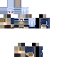
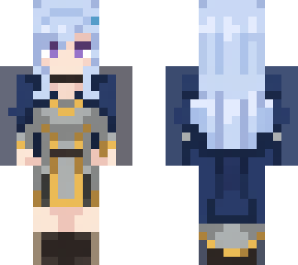
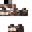
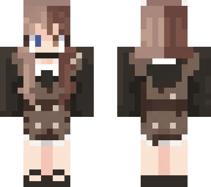
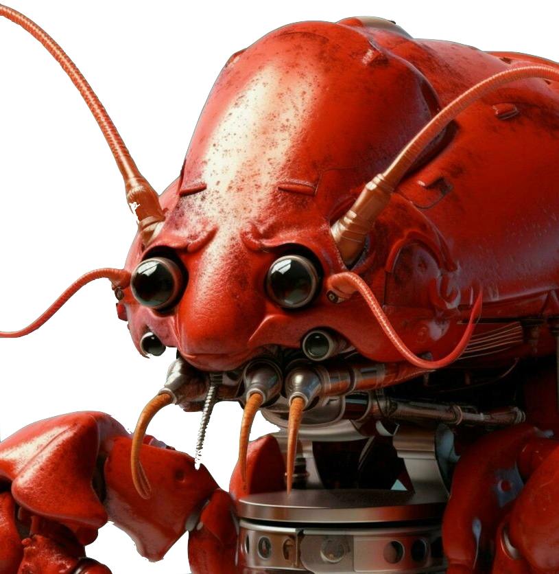
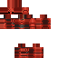
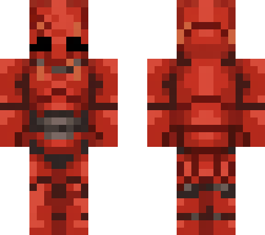

# img2skin

Turn any character image into a valid Minecraft skin.

img2skin takes a picture of a character (art, portrait, mascot, anything) and produces a ready-to-use 64x64 Minecraft skin PNG, plus a front/back preview. Generation uses Google's Nano Banana Pro image model (`gemini-3-pro-image`); everything after the single model call is deterministic image processing, so the output is always structurally valid.

## Examples

| Input | Skin (64x64) | Preview |
|---|---|---|
|  |  |  |
|  |  |  |
|  |  |  |

## Requirements

- Node.js 18 or newer
- A Gemini API key with access to `gemini-3-pro-image` (get one at [Google AI Studio](https://aistudio.google.com/)). Each skin costs roughly $0.13 and takes 15 to 20 seconds.

## Install

```sh
git clone https://github.com/sei-studio/img2skin.git
cd img2skin
npm install
echo 'GEMINI_API_KEY=your-key-here' > .env
```

## Usage

```sh
set -a && source .env && set +a

node src/pipeline.js character.png skin.png
```

This writes:

- `skin.png`: the finished 64x64 skin, ready to use in the Minecraft launcher or on a skin server
- `skin.preview.png`: a front/back render so you can check the result without launching the game
- `skin.raw-panel.png`: the raw model output, kept for debugging

Options:

```sh
node src/pipeline.js character.png skin.png --variant slim    # 3px arms (Alex model)
node src/pipeline.js character.png skin.png --branch atlas    # experimental, see below
node src/pipeline.js unused skin.png --mock panel.png         # reuse a saved model output, no API call
```

Validate any skin file against the layout rules:

```sh
node src/validate.js skin.png
```

## How it works

```
character image
  -> Nano Banana Pro renders the character as a front+back dual panel
     (blocky Minecraft style, fixed pose, magenta background)
  -> panel is located, grid-sampled with dominant-color voting,
     and projected onto the 64x64 skin UV atlas
  -> side, top, and bottom faces are synthesized from the front-face edges
  -> layout enforcement: never-rendered pixels made transparent,
     base layer made opaque, overlay layer background-keyed
  -> structural validation + preview render
```

The key design decision: the model is never asked to draw the flat UV atlas directly. Image models keep the general banding of the atlas but drift and bleed across region boundaries from run to run, so the result is not grid-exact. A front+back character render, in contrast, follows a strict layout contract reliably, and mapping it onto the atlas is a deterministic problem. The `--branch atlas` mode that asks for the atlas directly is kept for experimentation but is not recommended.

This design follows the same conclusion as the BLOCK paper (arXiv 2603.03964), which uses a canonical dual-panel render as its intermediate stage. Post-processing ideas (background-distance transparency keying, whitespace masking) come from Monadical's minecraft_skin_generator. See `references/NOTES.md`.

## Output guarantees

Every produced skin passes these checks:

- Never-rendered whitespace regions are fully transparent
- The base layer is fully opaque (holes are filled with the average color of their face)
- The overlay layer has background pixels keyed to transparent
- Classic (4px arm) and slim (3px arm) layouts are both supported

## Tests

The deterministic chain is covered by offline tests that need no API key:

```sh
npm test
```

- `tests/mock-test.js` degrades a real skin into a blurred, noisy mock model output and checks the pipeline reconstructs it with at most 2% pixel error
- `tests/panel-roundtrip.js` renders a real skin as a front/back panel, maps it back through the panel projector, and requires exact front and back face recovery

## Module map

| File | Role |
|---|---|
| `src/pipeline.js` | CLI and end-to-end orchestration |
| `src/layout.js` | 64x64 UV layout from box-unwrap geometry (classic and slim) |
| `src/gemini.js` | minimal REST client for Gemini image models |
| `src/prompts.js` | the panel and atlas generation prompts |
| `src/panelmap.js` | front+back panel to atlas projection, face synthesis |
| `src/downsample.js` | dominant-color downsampler |
| `src/enforce.js` | transparency and opacity enforcement |
| `src/render.js` | front/back preview renderer |
| `src/validate.js` | structural validity checker |
| `probe/` | scripts for measuring model layout consistency |

## Limitations

- Faces you cannot see in a front/back render (arm sides, top of the head, soles) are synthesized by darkening adjacent edge colors, not generated. They look fine at Minecraft resolution but are not detailed.
- One model call per skin; results vary between runs like any generative model. If a skin comes out odd, rerun it.
- Character images work best when the subject is a single character on a simple background.

## License

MIT
